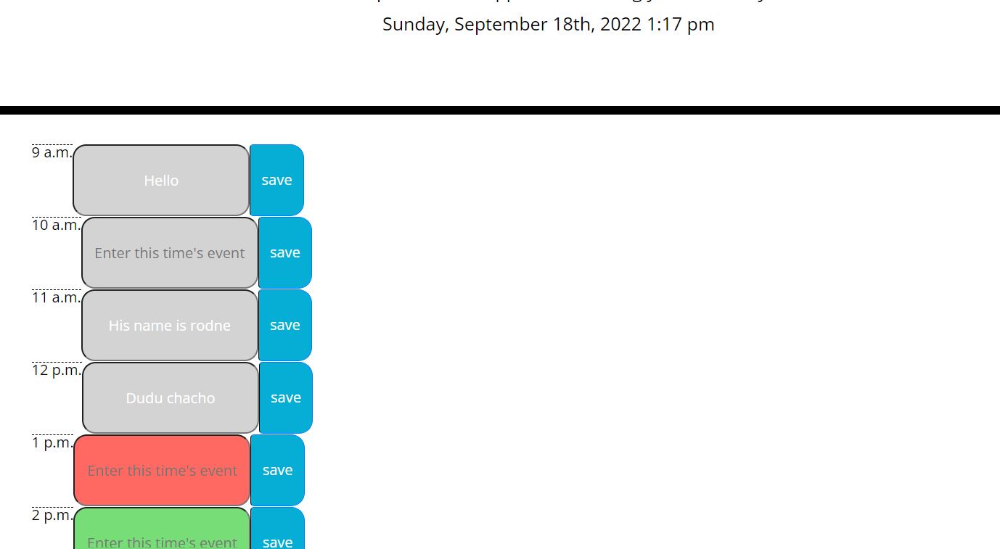

# Shedge-Pledge
Schedule day planner

# Description

    -I've created this little schedule day planner for the typical 9-5 busy body that need to jot down little quips on events that they need remembering for the day.

- [Installation](#installation)
- [Usage](#usage)
- [License](#license)
- [Features](#features)
## Installation

1. Go to https://github.com/joshdelmonte/Shedge-Pledge.git and clone the repository.
    
2. Type the following command in git bash:

    ~"git clone (pasted url from git repository)"

3. Access your desktop downloads and it should be in recent your recent downloads.

4. Open in whatever code editor you are using (i.e. VS Code, Intellij Idea, etc.)
-Feel free to modify however you wish via Visual Studio or whatever GUI you prefer.

-Here is the link to the page if you'd like to observe as well:

"https://joshdelmonte.github.io/Shedge-Pledge/"

## Usage

-Simply click any of the desired times you wish to alot a desired event. Jot it down and save it for future permanence

## License

MIT License

Copyright (c) [2022] [Joshua Delmonte]

Permission is hereby granted, free of charge, to any person obtaining a copy
of this software and associated documentation files (the "Software"), to deal
in the Software without restriction, including without limitation the rights
to use, copy, modify, merge, publish, distribute, sublicense, and/or sell
copies of the Software, and to permit persons to whom the Software is
furnished to do so, subject to the following conditions:

The above copyright notice and this permission notice shall be included in all
copies or substantial portions of the Software.

THE SOFTWARE IS PROVIDED "AS IS", WITHOUT WARRANTY OF ANY KIND, EXPRESS OR
IMPLIED, INCLUDING BUT NOT LIMITED TO THE WARRANTIES OF MERCHANTABILITY,
FITNESS FOR A PARTICULAR PURPOSE AND NONINFRINGEMENT. IN NO EVENT SHALL THE
AUTHORS OR COPYRIGHT HOLDERS BE LIABLE FOR ANY CLAIM, DAMAGES OR OTHER
LIABILITY, WHETHER IN AN ACTION OF CONTRACT, TORT OR OTHERWISE, ARISING FROM,
OUT OF OR IN CONNECTION WITH THE SOFTWARE OR THE USE OR OTHER DEALINGS IN THE
SOFTWARE.

---

## Features

-Notable features are the time designated to when the user has last logged in at the Jumbotron at the top, past and future events are color coded, and the save buttons for each timeblock from 9:00 to 17:00 for designated events.
---

## URLS
-Deployed URL
"https://joshdelmonte.github.io/Shedge-Pledge/"

-Github URL
"https://github.com/joshdelmonte/Shedge-Pledge.git"